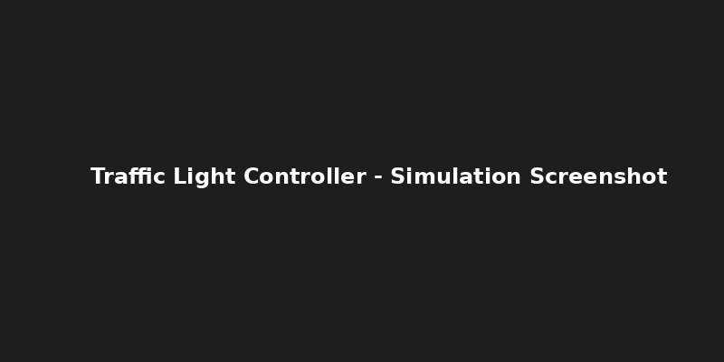

# 🚦 Traffic Light Controller using FSM (Verilog)

## 📝 Description
This is a Verilog project demonstrating a simple FSM-based traffic light controller. It cycles through Red, Green, and Yellow states with a timing mechanism.

## 📁 Files
- `TrafficLightController.v`: FSM implementation
- `tb_TrafficLightController.v`: Testbench for simulation

## 🛠 Tools Used
- **ModelSim**: For simulation
- **Vivado**: For synthesis and FPGA programming

## 📷 Screenshot

## ▶️ Simulation Instructions
1. Open ModelSim.
2. Compile and simulate the files.
3. Observe `lights` output waveform to see state transitions.

## 🔁 FSM State Transition
- RED → GREEN → YELLOW → RED

---

